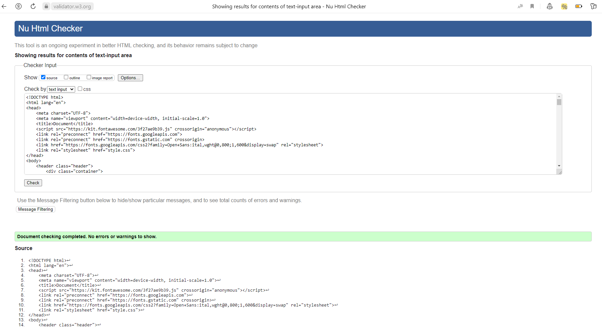
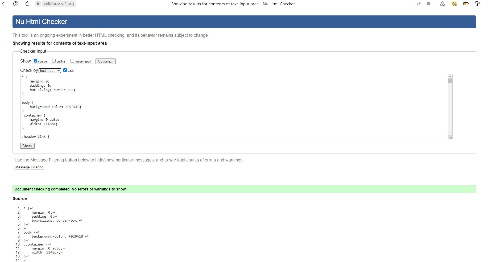

***HomeWork 10. (К уроку 18). Семинар. Проверка сайта на ошибки и вспомогательные инструменты (вебинар)***

Макет https://www.figma.com/file/mnLY69cYE5cqWM5w6n5hXx/Seo-%26-Digital-Marketing-Landing-Page?node-id=190%3A1194

Выбрала темный макет https://www.figma.com/file/YdTWFhQmE5f7aKPiJ4Fu1H/Landing_Page-(Copy)-(Copy)-(Copy)?node-id=10%3A585&mode=dev

1. Доделать, если что-то не получилось реализовать на прошлом уроке.

2. Проверить сайт на ошибки. 

Проверка кода index.html

Исправила ошибки

Проверка кода style.css 

Исправила ошибки

3. * Разместить сайт в сети интернет.

Ссылка на сайт

https://willowy-licorice-447343.netlify.app/#

Данная промежуточная аттестация оценивается по системе "зачет" / "не зачет".

Критерии оценивания:
Зачет выставляется при выполнении слушателем всех критериев: сайт запускается и работает
Незачет выставляется, если сайт не запускается или выдает ошибки при работе

